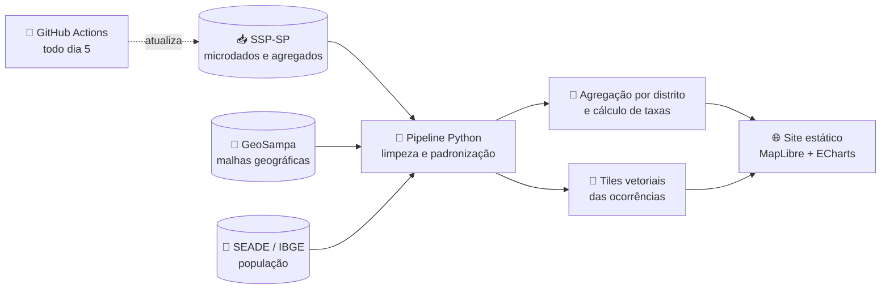

<div align="center">


**Quão segura está a sua rua? Os dados de segurança pública de São Paulo, do distrito à esquina.**

[](https://marcostoquetao.github.io/MapaSegurancaSP/)


</div>

---

## 📍 Sobre o projeto

O **Cidade Segura** é uma plataforma interativa, aberta e gratuita que reúne os registros de ocorrências da **Secretaria de Segurança Pública do Estado de São Paulo (SSP-SP)** para a capital paulista e os apresenta de forma visual e navegável.

> [!TIP]
> **Premissa de design:** *existem ruas perigosas em bairros seguros.*
> Por isso o mapa combina duas leituras: a **visão macro**, por distrito e subprefeitura, e a **visão micro**, com a localização de cada ocorrência no nível da rua.

O objetivo é duplo: servir como **ferramenta cidadã**, para que qualquer pessoa consiga consultar a realidade do lugar onde mora, trabalha ou circula, e como **demonstração técnica** de um pipeline completo de dados abertos, da coleta à visualização.

---

## ✨ O que você encontra no site

| Seção | O que mostra |
|:---|:---|
| 🗺️ **Mapa** | Distritos coloridos por intensidade, pontos de cada ocorrência no nível da rua e a **ficha do lugar**: busque sua rua (ou use sua localização) para ver o que aconteceu num raio de 500 m, ou toque num distrito para compará-lo à média da cidade |
| 📊 **Explorar** | Filtros cruzados (tipo, região, local, hora, circunstância) e o mapa de calor dia da semana × hora |
| 📈 **Tendências** | Evolução mensal dos indicadores ao longo do tempo |
| 💜 **Mulheres** | Painel dedicado a violência doméstica e feminicídios |

**Crimes cobertos:** roubo e furto de **celular**, de **casa** (residência) e de **veículo**, todos os roubos e furtos, **agressão** (lesão corporal dolosa) e **mortes violentas** (homicídio doloso, latrocínio e lesão seguida de morte). Crimes sexuais aparecem só nos gráficos: o endereço é anonimizado por lei.

**Métricas:** números absolutos e **taxa por 100 mil habitantes** (Censo 2022), permitindo comparar regiões com populações muito diferentes de forma justa.

---

## ⚙️ Como foi feito



Todo o processamento acontece antes da publicação. O site final é **100% estático**: não há servidor nem banco de dados, e toda a interação roda no navegador de quem acessa. Isso torna a plataforma leve, barata de manter e fácil de reproduzir.

| Camada | Tecnologia |
|:---|:---|
| Coleta e processamento | Python (pandas, geopandas) |
| Tiles de pontos | PMTiles gerados em Python |
| Front-end | Vite, MapLibre GL JS e ECharts, sem framework |
| Hospedagem | GitHub Pages |
| Automação | GitHub Actions (deploy e atualização mensal dos dados) |

---

## 🗂️ Organização do repositório

```
MapaSegurancaSP/   # o site se chama Cidade Segura; o repositório manteve o nome
├── docs/            # plano, fontes de dados, dicionário e metodologia
├── data/
│   ├── external/    # malhas geográficas e população (SEADE/IBGE/GeoSampa)
│   └── processed/   # dados processados (agregados, GeoJSON, PMTiles)
├── pipeline/        # scripts Python de coleta e tratamento
└── web/             # código do site
```

Detalhes metodológicos e descrição das variáveis estão em [`docs/`](docs/).

---

## 📚 Fontes de dados

| Dado | Fonte |
|:---|:---|
| Ocorrências criminais | **SSP-SP** (microdados e agregados) |
| População | **SEADE / IBGE** (Censo 2022) |
| Malhas de distritos e subprefeituras | **GeoSampa** |

A descrição completa de cada base está em [`docs/FONTES.md`](docs/FONTES.md).

---

## ⚠️ Como interpretar os dados

> [!IMPORTANT]
> O mapa mostra **ocorrências registradas**, não a totalidade dos crimes. Alguns tipos de crime, como furtos de menor valor e violência sexual, são historicamente **subnotificados**, e a taxa de registro pode variar entre regiões. Uma área com poucos registros não é necessariamente uma área segura.

- As ocorrências são localizadas pelo **local do fato** informado no boletim, cuja precisão depende do preenchimento original.
- Os números conferem com a **tabela oficial mensal da SSP** para a capital (checagem automática em `pipeline/09_checar.py`).
- Taxas por 100 mil habitantes usam a **população residente**, o que pode superestimar o risco em regiões com grande circulação e poucos moradores, como o centro da cidade.

---

<div align="center">

**Feito por [Marcos Toquetão](https://github.com/MarcosToquetao)** · Dados públicos, código aberto

⭐ Se o projeto foi útil para você, deixe uma estrela no repositório!

</div>
